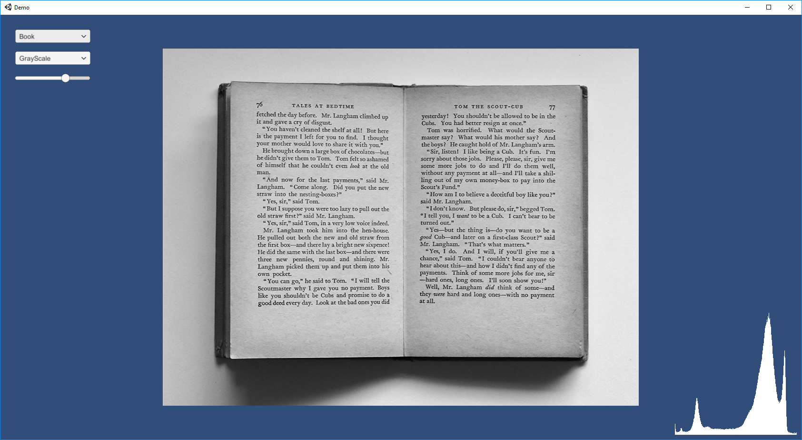
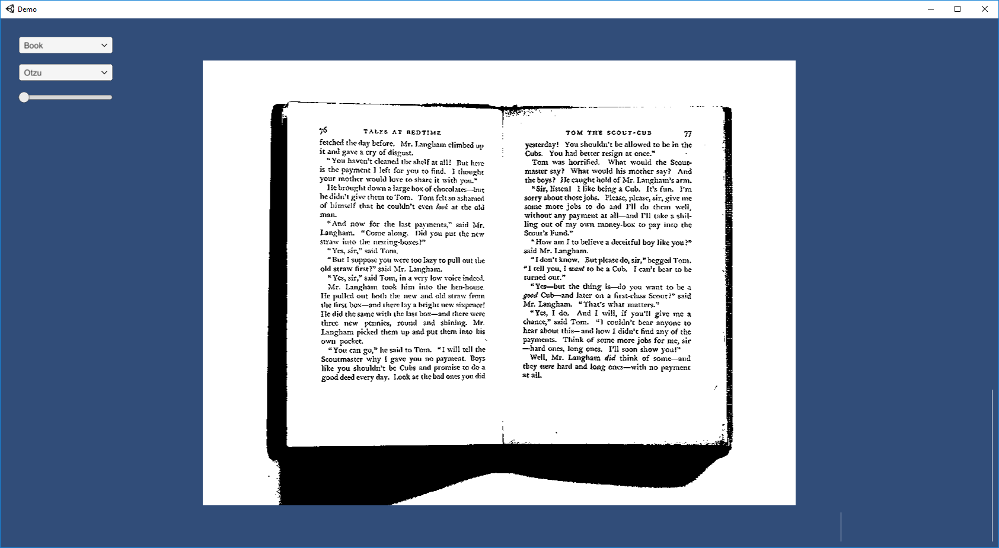

# Content
This repository wraps image segmentation algorithms from opencv in a c++ interface with the purpose of using them through [unitys native plugin](https://docs.unity3d.com/Manual/NativePlugins.html)

https://opencv.org/

The subfolder called "Vision" contains the wrapper, while the "Demo" subfolder is a unity example of how to use it

The current supported image segmentation algorihms are

* [Thresholding using Otsu's Binarization](https://docs.opencv.org/3.3.1/d7/d4d/tutorial_py_thresholding.html)

The unity example show the use of the algorithm and the histogram of intermediate steps

Changing the gausian blur contribution, can have a big impact on the finale result

[Try the demo by cliking here](https://github.com/LightTrails/Vision/releases/download/0.1/Demo.zip)

